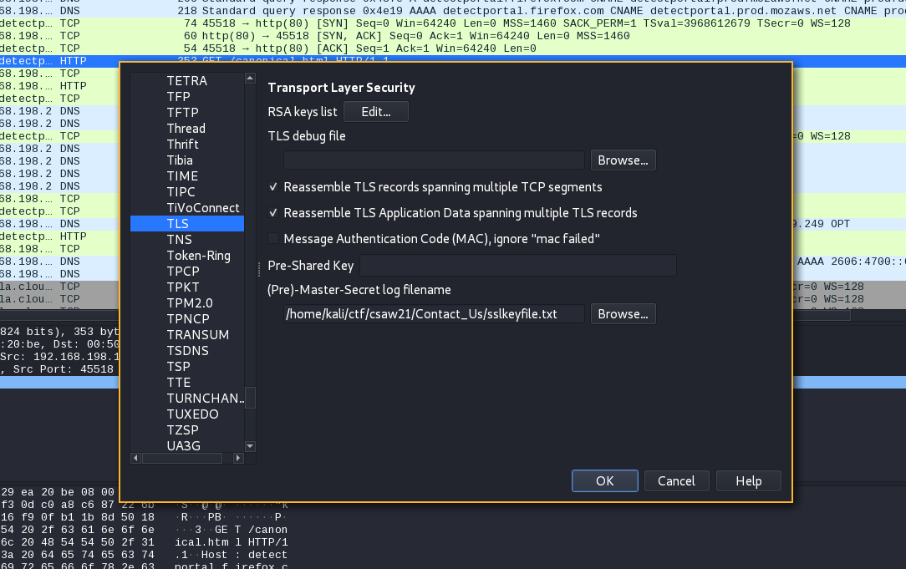
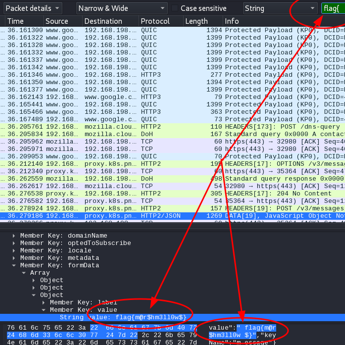
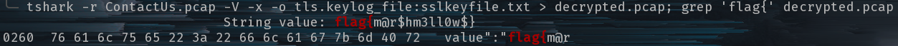

# Contact Us

Writeup by: [OreoByte](https://github.com/OreoByte)

Team: [OnlyFeet](https://ctftime.org/team/144644)

Writeup URL: [GitHub](https://infosecstreams.github.io/csaw21/contact-us/)

---

```text
Veronica sent a message to her client via their website's Contact Us page. Can you find the message?

Author: moat, Pacific Northwest National Laboratory
```

## Using Wireshark Decrypt The SSL Traffic

Using the given files `sslkeyfile.txt` and `ContactUs.pcap` we can start to decrypt the pcap.

Navigate through `Edit -> Preferences -> Protocols -> TLS -> (Pre)-Master-Secret log filename`, click browse and select the `sslkeyfile.txt` file.

\

Find the decrypted flag in the packet capture.

\

---

## Using Tshark

You can do the same thing but with `tshark`:

1. Decrypt Pcap into a new file
    * `tshark -r ContactUs.pcap -V -x -o tls.keylog_file:key.log  > results`

1. grep to win for the flag
    * `grep 'flag{' results`

\

---

## Victory

Submit the flag and claim the points:

`flag{m@r$hm3ll0w$}`
