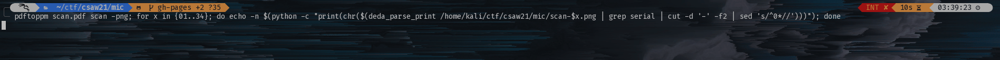

# mic

Writeup by: [GoProSlowYo](https://github.com/GoProSlowYo)

Team: [OnlyFeet](https://ctftime.org/team/144644)

Writeup URL: [GitHub](https://infosecstreams.github.io/csaw21/mic/)

----

```text
My Epson InkJet printer is mysteriously printing blank pages. Is it trying to tell me something?
```

## Initial Research

The text seems to reference the printer "telling" us something. This 'something' is [`MIC`](https://en.wikipedia.org/wiki/Machine_Identification_Code)'s in the printer page.

> Tiny dots are embedded on printouts by modern printers. Markings like these were used to trace [NSA documents leaked to The Intercept by Reality Winner](http://www.bbc.com/future/story/20170607-why-printers-add-secret-tracking-dots)


## Getting the Flag from the Printed Pages

We wrote a quick one liner to dump the flag:

```shell
$ pdftoppm scan.pdf scan -png; for x in {01..34}; do echo -n $(python -c "print(chr($(deda_parse_print /home/kali/ctf/csaw21/mic/scan-$x.png | grep serial | cut -d '-' -f2 | sed 's/^0*//')))"); done
flag{watchoutforthepoisonedcoffee}
```

\

## Victory

Submit the flag and claim the points:

**flag{watchoutforthepoisonedcoffee}**
