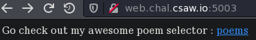
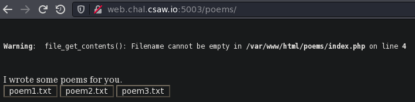
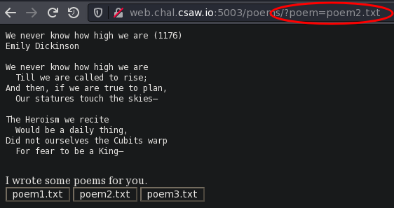
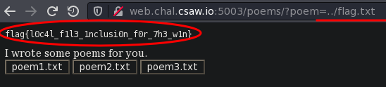

# Poem Collection

Writeup by: [GoProSlowYo](https://github.com/GoProSlowYo) and solved by [Joe](https://github.com/ghost).

Team: [OnlyFeet](https://ctftime.org/team/144644)

Writeup URL: [GitHub](https://infosecstreams.github.io/csaw21/poem-collection/)

----

```text
Hey! I made a cool website that shows off my favorite poems. See if you can find flag.txt somewhere!

http://web.chal.csaw.io:5003
```

----

## Poems :)

We find a page offering us some poetry.



----

## PHP Errors?

If we browse to the page it throws a PHP error already -- clearly a `Filename` was not provivded!

```php
Warning:  file_get_contents(): Filename cannot be empty in /var/www/html/poems/index.php on line 4
```



----

## Choose a Poem

If we choose a poem the error goes away and a poem is displayed. We also notice a GET parameter named `poem` is populated in the url and is pointing to a file.

`?poem=poem2.txt`



----

## Victory

We can change this to ask for the flag:

`?poem=../flag.txt`



Submit the flag and claim the points:

**flag{l0c4l_f1l3_1nclusi0n_f0r_7h3_w1n}**
