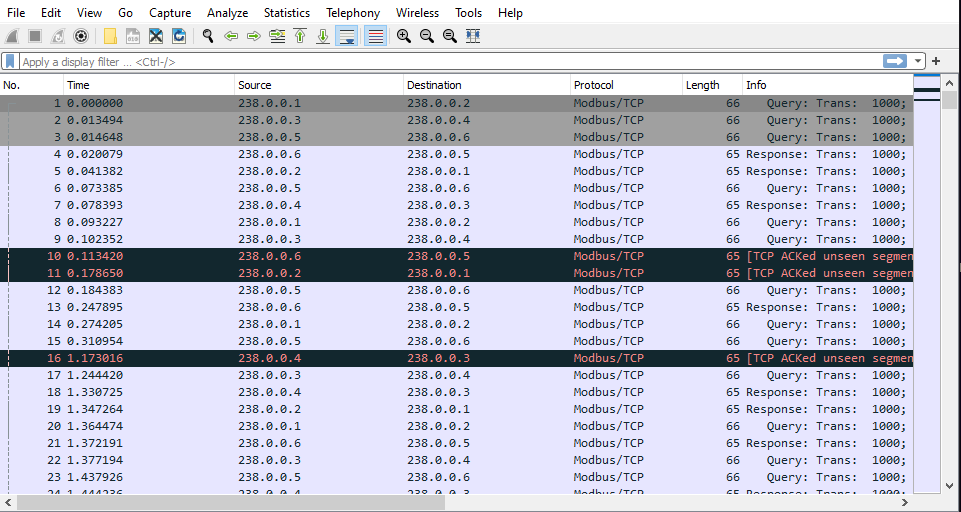
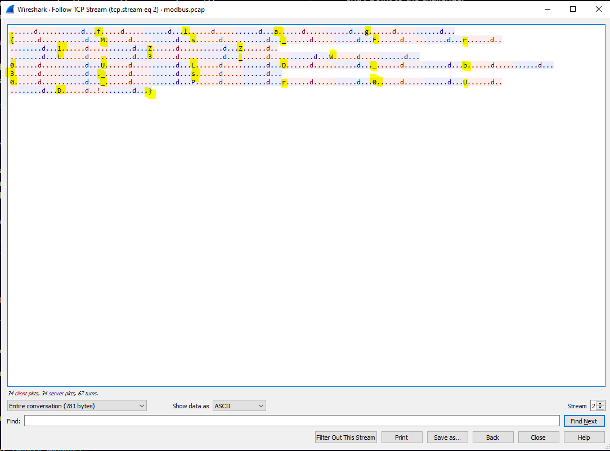

# The Magic Modbus

Writeup by: [XAngryChairX](https://github.com/XAngryChairX)

Team: [OnlyFeet](https://ctftime.org/team/144644)

Writeup URL: [GitHub](https://infosecstreams.github.io/csaw21/the-magic-modbus/)

----

`Climb on the Magic Modbus and see if you can find some of the messages being passed around!`

## Initial Research

This challenge presents the security researcher with a pcap file download as the entry point to the challenge.

## PCAP Download

Download the pcap file and open it in Wireshark or a related pcap analysis application.

## Follow the stream

Note that a few packets have a dark background. These stand out, and provide an opportune entry point. Click the first packet with a dark background and follow the TCP stream.

## TCP Stream

Upon inspection of the TCP stream, you can see some key characters of interest. Specifically, { and }. Also, the characters `f`, `l`, `a`, and `g`.

## Solution

Following the pattern above, you can decipher the flag.

Submit the flag and claim the points:

**flag{Ms_F1ZZL3_W0ULD_b3_s0_Pr0UD}**
